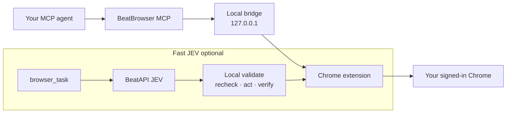

<p align="center">
  <a href="#quick-start">Quick start</a> ·
  <a href="#how-it-works">How it works</a> ·
  <a href="#two-modes-one-browser">Two modes</a> ·
  <a href="#how-it-compares">Compare</a> ·
  <a href="#real-browser-control-smoke-test">Live proof</a> ·
  <a href="docs/JEV_FAST_AGENT.md">Fast JEV guide</a>
</p>

# BeatBrowser

Open-source **browser control for agents**, built around the Chrome profile you
already use day to day.

- Drive your **signed-in Chrome** through a local MCP server + extension
  (no clean browser, no remote desktop required).
- **Normal mode**: 23 explicit tools — your outer agent observes and acts.
- **Fast JEV mode** (optional): BeatAPI JEV picks from a finite, current action
  space; local code validates, executes, and verifies every step.

Both modes share the same extension, loopback bridge, cookies, and sessions.
Fast JEV is an execution mode, not a second browser.

## How it works



Traffic for Normal mode stays on your machine (MCP ↔ loopback ↔ extension).
Fast JEV only sends **bounded, redacted** task/page state to BeatAPI when you
explicitly enable it and consent per task — never cookies, raw HTML, or
screenshots. See [PRIVACY.md](PRIVACY.md).

## Two modes, one browser

| | Normal | Fast JEV |
| --- | --- | --- |
| Interface | 23 MCP browser tools | Optional `browser_task` or `beat-browser run` |
| Decision maker | Your outer agent | JEV chooses from a finite, current action space |
| Browser | Your existing signed-in Chrome | The same signed-in Chrome |
| BeatAPI key | Not required | Required for live JEV decisions |
| Best for | Exploration, debugging, unusual pages | Repetitive bounded flows with exact inputs and clear success checks |
| Verification | Outer agent reads tool effects | Local assertions plus effect / durable-result checks |
| Fallback | Continue with any MCP tool | Stop and return control to Normal or a human |

Practical workflow: use **Normal** once to learn a site and save notes, then
**Fast JEV** for the repeatable path.

## How it compares

Not a sponsorship claim and not a universal speed ranking — a map of where
BeatBrowser sits among the stacks agents actually meet.

### At a glance

| Approach | Browser / session | Control surface | Who decides | Best fit |
| --- | --- | --- | --- | --- |
| **BeatBrowser** | Your existing signed-in Chrome | MCP + extension (23 tools + optional Fast JEV) | Outer agent, or BeatAPI JEV in Fast mode | Bring-your-own agent on the Chrome you already use |
| [**jev-ultrafast**](https://github.com/browser-use/jev-ultrafast) | Browser Use harness / CDP | Python JEV loop over a dynamic legal action space | JEV (+ optional small LLM for text) | Fast typed-decision demos in the Browser Use stack |
| **Claude in Chrome** | Chrome with Anthropic’s extension | Product UI / Claude tools | Claude (cloud) | “Claude, use my browser” inside Anthropic’s product |
| **ChatGPT extension / Codex** | Browser session owned by OpenAI’s surface | ChatGPT / Codex product tools | Codex / ChatGPT (cloud) | “Codex / ChatGPT, browse for me” inside OpenAI’s product |
| **Playwright MCP** | Playwright-launched or attached browser | MCP tools over Playwright | Outer agent via Playwright APIs | Scriptable automation, CI, clean or attached browsers |
| **chrome-devtools-mcp** | Chrome via DevTools Protocol | MCP over CDP / DevTools | Outer agent via low-level CDP | Debugging, performance, protocol-level control |
| **Browser Use** | Controlled browser (often CDP / harness) | Python agent framework + tools | Outer LLM + Browser Use runtime | Full Python browser-agent apps |

### Where BeatBrowser differs

**vs jev-ultrafast** — same core idea: narrow each step into a typed decision
over legal ops + targets, then execute locally. BeatBrowser ports that pattern
onto a **JavaScript MCP + extension** stack and keeps Normal mode beside Fast
JEV, so exploration and bounded speed share one signed-in Chrome.

**vs Claude in Chrome / ChatGPT extension (Codex)** — excellent when you live inside
that vendor’s chat/agent product. BeatBrowser is for when the agent is **yours**
(Claude Code, Cursor, OpenCode, custom MCP clients, …) and the browser is the
profile you already logged into.

**vs Playwright MCP** — Playwright is the right hammer for scripts, CI, and
clean browsers. BeatBrowser is extension-first for **daily signed-in Chrome**
(cookies, SSO, the tabs you already have), with optional Fast JEV on top.

**vs chrome-devtools-mcp** — DevTools/CDP MCP is protocol-precise and great for
debug / perf. BeatBrowser sits one layer up: agent-ready browser tools, site
learnings, and a bounded Fast JEV executor — not a raw CDP console.

**vs Browser Use** — Browser Use is a full Python browser-agent framework.
BeatBrowser is a focused MCP + Chrome extension product: Normal tools for any
MCP agent, Fast JEV when you want typed decisions without leaving your profile.

## Real browser-control smoke test

On 2026-09-20, the same signed-in X account published three approved replies in
each mode. All six replies were confirmed through permanent X status URLs.

| Mode | Verified | Total | Mean per reply |
| --- | ---: | ---: | ---: |
| Normal | 3/3 | 170.444 s | 56.815 s |
| Fast JEV | 3/3 | 36.240 s | 12.080 s |

The final Fast path was **4.7× faster** on this small workload. Its three
successful runs made 10 JEV calls and used 68,391 input tokens. At BeatAPI’s
2026-09-20 JEV price of $0.042 per million input tokens with unbilled output,
that was about **$0.00287 total**.

Narrow smoke test (`n=3` per mode), not a general reliability or performance
benchmark. See [TEST_RESULTS.md](TEST_RESULTS.md) for evidence and boundaries.

## Quick start

Requirements: Node.js 20+, Chrome, and an MCP-capable agent.

```bash
git clone https://github.com/BeatAPI/beat-browser.git
cd beat-browser
npm ci
node src/cli.js install
node src/cli.js doctor --json
```

Load the unpacked extension printed by `node src/cli.js extension`. Agent-led
installation details are in [AGENT_INSTALL.md](AGENT_INSTALL.md).

In a source checkout, use `node src/cli.js` where the examples below use the
installed `beat-browser` command.

### Normal mode

```bash
beat-browser mcp
```

Your agent gets 23 tools for tabs, snapshots, clicks, typing, forms, network
reads, screenshots, human handoff, and site learnings.

### Fast JEV mode

Validate locally first (no browser or model request):

```bash
beat-browser run --dry-run \
  --url https://example.com \
  --goal 'Check that the Example Domain page is ready'
```

Live run (needs `BEATAPI_API_KEY`, explicit enable, and task-specific
inputs/assertions when the workflow writes or submits):

```bash
export BEATAPI_API_KEY='your-key-from-a-secret-manager'

beat-browser run --enable-fast-agent \
  --url https://example.com \
  --goal 'Check that the Example Domain heading is visible' \
  --max-steps 10 \
  --max-model-calls 20 \
  --timeout-ms 60000
```

Expose Fast JEV through MCP:

```bash
beat-browser mcp --enable-fast-agent
```

`browser_task` still requires `cloudConsent: true` per task. Read the
[Fast JEV guide](docs/JEV_FAST_AGENT.md) and [privacy boundary](PRIVACY.md)
before enabling it.

## Why Fast JEV moves faster

Traditional browser-agent loops repeatedly serialize a page, ask a large model
what to do, then make one browser call. Fast JEV narrows each observation into
a typed decision problem:

```text
signed-in Chrome
      │
      ▼
structured live DOM ──► legal operations + compatible targets
                              │
                              ▼
                    one BeatAPI JEV request
                              │
                              ▼
                 local validation and live recheck
                              │
                              ▼
                    one action + local verify
```

JEV never returns selectors, coordinates, shell commands, or JavaScript. The
extension keeps the real DOM node, rechecks it immediately before acting, and
stops on stale identity, domain drift, challenges, unsupported controls, or
uncertain side effects.

## Learn once, reuse the path

- Bundled notes: `docs/learnings/`
- Local notes: `~/.beat-browser/learnings/` (not overwritten by upgrades)

Call `learnings({ domain: "x.com" })` before operating a known site. When the
page disagrees with a note, trust the page, then save the corrected workflow.

Learnings are hints, never authority — no credentials, cookies, private drafts,
or unpublished user content.

## What Fast JEV can and cannot do

Supports visible, enabled controls in the top frame’s light DOM: click, exact
text input, native select, scroll, wait, and completion/block decisions. The
caller decides which business actions are authorized.

Technical limits: challenges, cross-domain drift, stale targets, iframes,
shadow DOM, canvas controls, file uploads, arbitrary keyboard widgets, and some
custom dropdowns. An uncertain action returns control and is never replayed
automatically.

## Development

```bash
npm test
npm run check:syntax
npm run check:security
npm run build:extension
npm run benchmark:offline -- --iterations 3
```

Offline benchmarks validate control flow with fixtures; they do not establish
real model latency. Live evidence: [TEST_RESULTS.md](TEST_RESULTS.md).

## License

MIT — see [LICENSE](LICENSE).
