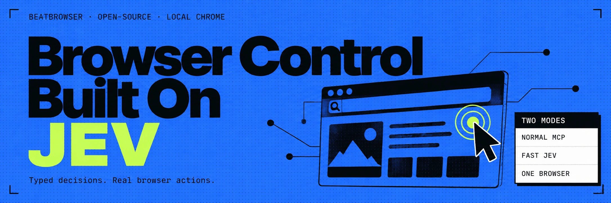
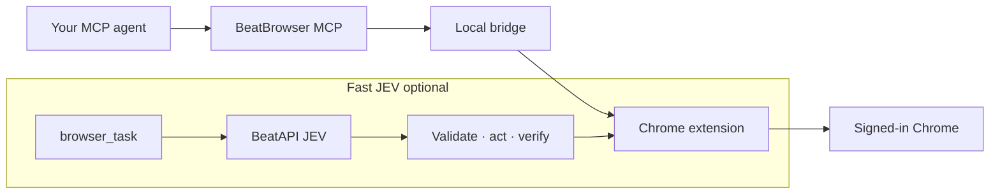

<div align="center">



# BeatBrowser

**Let any MCP agent control your own Chrome — with full login state.**

MCP server + Chrome extension. **Normal** tools for exploration. Optional **Fast JEV** for bounded speed.
Same profile, cookies, and sessions. No clean browser. No remote desktop.

[Website](https://beatapi.io/jev-api) · [Quick start](#quick-start) · [Compare](#how-it-compares) · [Live proof](#live-proof) · [Fast JEV guide](docs/JEV_FAST_AGENT.md)

</div>

---

## Why BeatBrowser

Browser control today usually splits two ways: products that reach your real login state but stay locked to one vendor, or open stacks that open a clean browser with none of your sessions.

BeatBrowser takes both:

- **Your daily Chrome** — extension on the profile you already use
- **Any MCP agent** — Claude Code, Cursor, OpenCode, Codex CLI, custom clients
- **Two modes, one browser** — Normal (23 tools) and optional Fast JEV (typed decisions via [BeatAPI JEV](https://beatapi.io/jev-api))

Fast JEV is an execution mode, not a second browser.

## How it works



Normal traffic stays local (MCP ↔ `127.0.0.1` ↔ extension). Fast JEV only sends **bounded, redacted** task/page state when you enable it and consent per task — never cookies, raw HTML, or screenshots. See [PRIVACY.md](PRIVACY.md).

## Two modes, one browser

<div align="center">

| | Normal | Fast JEV |
| :---: | :---: | :---: |
| Interface | 23 MCP tools | `browser_task` / `beat-browser run` |
| Decides | Your outer agent | BeatAPI JEV over a finite action space |
| Browser | Your signed-in Chrome | Same Chrome |
| API key | Not required | Required for live JEV |
| Best for | Explore, debug, odd pages | Repeatable flows with clear success checks |
| On doubt | Keep using any tool | Stop; return to Normal or a human |

</div>

Learn a site once in **Normal**, save notes, then run the path in **Fast JEV**.

## How it compares

Same shape as the common browser-control matrix: checkmark plus a short note
when it helps. ✅ yes · ⚠️ partial / setup-dependent · ❌ no. Directional against
public docs — not a sponsorship claim or speed ranking.

| | **BeatBrowser** | [jev-ultrafast](https://github.com/browser-use/jev-ultrafast) | Claude in Chrome | ChatGPT / Codex | Playwright MCP | chrome-devtools-mcp | Browser Use |
| --- | --- | --- | --- | --- | --- | --- | --- |
| Daily Chrome + real login | ✅ Extension on the profile you already use | ⚠️ Harness / CDP; profile varies | ✅ | ✅ | ⚠️ Extension / attach mode | ⚠️ Remote debugging / DevTools attach | ⚠️ Harness or remote Chromium |
| Any MCP agent | ✅ MCP is the primary interface | ❌ Python harness, not MCP-first | ❌ Anthropic clients only | ❌ OpenAI product surface | ✅ | ✅ | ⚠️ Library; MCP not the default |
| No debug port / launch flags | ✅ Load unpacked extension | ❌ CDP / harness launch | ✅ | ✅ | ⚠️ Extension mode can avoid it | ❌ Needs DevTools / remote debugging | ❌ Chromium or remote debugging |
| Explicit Normal explore tools | ✅ 23 MCP browser tools | ⚠️ JEV-centric loop | ⚠️ Inside Claude only | ⚠️ Inside ChatGPT / Codex | ✅ Playwright APIs over MCP | ✅ Low-level CDP / DevTools | ✅ Agent tools in Python runtime |
| Optional Fast JEV typed loop | ✅ Finite ops + targets; local validate / act / verify | ✅ Core product loop | ❌ | ❌ | ❌ | ❌ | ⚠️ Custom loops possible; not BeatAPI Fast JEV |
| Dual mode, one signed-in browser | ✅ Normal **and** Fast JEV share cookies / sessions | ❌ JEV-focused | ❌ Single product loop | ❌ Single product loop | ❌ Playwright session model | ❌ DevTools session model | ⚠️ One runtime; no Normal+Fast split |
| Compounding site learnings | ✅ Bundled notes + local `~/.beat-browser/learnings` | ⚠️ Project-specific | ❌ Product memory only | ⚠️ Product memory | ❌ | ❌ | ⚠️ Exists; often off by default |
| Human handoff (captcha / pay / judgment) | ✅ Handoff tool + stop-on-uncertain Fast path | ⚠️ Depends on harness wiring | ✅ Pauses for you | ⚠️ Sensitive-action confirms | ❌ | ❌ | ⚠️ Stronger in hosted / cloud setups |

**In short:** Claude in Chrome and ChatGPT/Codex win inside their own products. Playwright MCP and chrome-devtools-mcp win for scripts, CI, and protocol work. [jev-ultrafast](https://github.com/browser-use/jev-ultrafast) is the typed-decision reference in the Browser Use stack. BeatBrowser is for when **your** agent needs **your** signed-in Chrome — with Normal tools and optional Fast JEV on the same profile.

## Live proof

Same signed-in X account, three approved replies per mode, all confirmed via permanent status URLs.

<div align="center">

| Mode | Verified | Total | Mean / reply |
| :---: | :---: | :---: | :---: |
| Normal | 3/3 | 170.4 s | 56.8 s |
| Fast JEV | 3/3 | 36.2 s | 12.1 s |

</div>

Fast path was **~4.7× faster** on this workload (10 JEV calls, ~68k input tokens, about **$0.003** at BeatAPI JEV list pricing of $0.042 / 1M input tokens).

Narrow smoke test (`n=3` per mode), not a general benchmark. Full evidence: [TEST_RESULTS.md](TEST_RESULTS.md).

## Quick start

Node.js 20+, Chrome, and an MCP-capable agent.

```bash
git clone https://github.com/BeatAPI/beat-browser.git
cd beat-browser
npm ci
node src/cli.js install
node src/cli.js doctor --json
```

Load the unpacked extension from `node src/cli.js extension`. Agent-led install: [AGENT_INSTALL.md](AGENT_INSTALL.md).

In a source checkout, use `node src/cli.js` where examples show `beat-browser`.

### Normal mode

```bash
beat-browser mcp
```

23 tools: tabs, snapshots, clicks, typing, forms, network, screenshots, human handoff, learnings.

### Fast JEV mode

Dry-run first (no browser or model call):

```bash
beat-browser run --dry-run \
  --url https://example.com \
  --goal 'Check that the Example Domain page is ready'
```

Live run (needs `BEATAPI_API_KEY` and explicit enable):

```bash
export BEATAPI_API_KEY='your-key-from-a-secret-manager'

beat-browser run --enable-fast-agent \
  --url https://example.com \
  --goal 'Check that the Example Domain heading is visible' \
  --max-steps 10 \
  --max-model-calls 20 \
  --timeout-ms 60000
```

Via MCP:

```bash
beat-browser mcp --enable-fast-agent
```

`browser_task` requires `cloudConsent: true` per task. Read the [Fast JEV guide](docs/JEV_FAST_AGENT.md) and [PRIVACY.md](PRIVACY.md) first. JEV product page: [beatapi.io/jev-api](https://beatapi.io/jev-api).

## Why Fast JEV moves faster

```text
signed-in Chrome
      │
      ▼
live DOM → legal operations + targets
      │
      ▼
one BeatAPI JEV request
      │
      ▼
local validate → act → verify
```

JEV never returns selectors, coordinates, shell, or JavaScript. The extension keeps the real DOM node, rechecks before acting, and stops on stale identity, domain drift, challenges, or uncertain side effects.

## Learn once, reuse the path

- Bundled: `docs/learnings/`
- Local: `~/.beat-browser/learnings/` (not overwritten by upgrades)

Call `learnings({ domain: "x.com" })` before a known site. If the page disagrees, trust the page, then save the corrected path. Learnings are hints — never credentials, cookies, or private drafts.

## Limits

Fast JEV supports visible, enabled controls in the top-frame light DOM: click, exact text, native select, scroll, wait, done/blocked. Challenges, iframes, shadow DOM, canvas, uploads, and many custom widgets are out of scope; uncertain actions return control and are never auto-replayed.

## Development

```bash
npm test
npm run check:syntax
npm run check:security
npm run build:extension
npm run benchmark:offline -- --iterations 3
```

## License

MIT — see [LICENSE](LICENSE).
