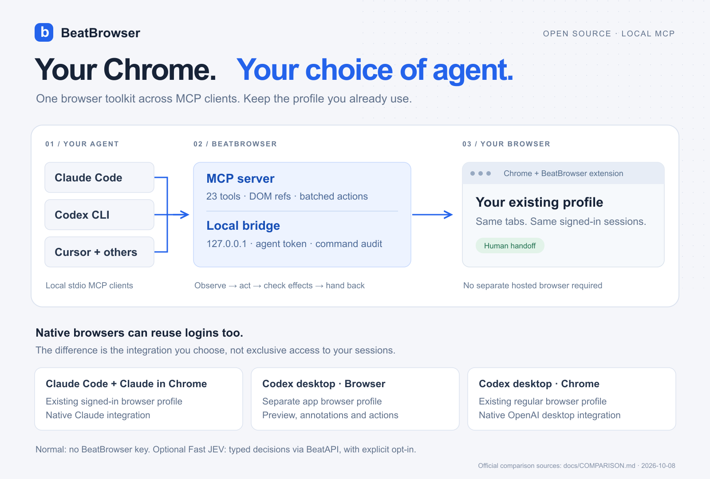

<div align="center">

# BeatBrowser

**Your Chrome. Your choice of agent.**

Let an MCP-capable agent work in the Chrome profile you already use.
Keep your signed-in sessions when you switch between Claude Code, Codex CLI, Cursor and other MCP clients.



[](LICENSE)


[Install](#install) · [Compare](#how-it-compares) · [Tools](#tools) · [Demo guide](docs/DEMO.md) · [Security](#security-and-privacy)

</div>

## What you can do

Ask your agent to read a dashboard, collect a few records, fill a draft or test a web app in **your existing Chrome**. You handle login or a challenge when needed, then the agent continues in that same profile.

> "Read the issues in this repository, summarize the three most recent reports, and fill a draft triage note. Stop before submitting anything."

BeatBrowser provides browser tools; your agent supplies the reasoning and model. Normal mode needs no BeatBrowser account or API key. Optional Fast JEV adds a bounded decision loop for compatible tasks.

## How it works

```text
Claude Code / Codex CLI / Cursor / other MCP clients
                       │ stdio MCP
              BeatBrowser MCP server
                       │ token-authenticated agent connection
              Local bridge · 127.0.0.1
                       │ WebSocket
              Chrome extension
                       │
          Your existing Chrome profile
```

- **Observe:** compact DOM snapshots and refs, readable text, structured queries and screenshots.
- **Act:** batch predictable steps with `act`, inspect effects and assertions, then observe again when the page changes.
- **Reuse:** save reviewed site notes and playbooks in `~/.beat-browser/learnings/`. Another agent can read the same local notes. The tool does not automatically learn or fine-tune a model.
- **Hand back:** use `ask` for login, CAPTCHA, OTP or a decision that needs you.

Multiple clients can connect. Label your tabs and pass `tabId` explicitly; concurrent writes to the same tab are not isolated. When multiple Chrome profiles are connected, Normal commands use the bridge's selected primary extension; per-profile routing is not a promised capability.

## Install

Requirements: Node.js 20+, Chrome 116+ and a client that can launch a local stdio MCP server. The extension is loaded unpacked; it is not listed on the Chrome Web Store.

### npm

Install the CLI from the official npm registry. Use the source path below when developing BeatBrowser.

Install globally so Chrome's extension folder stays at a stable path:

```bash
npm install --global @beatapi/beat-browser
beat-browser install --dry-run   # preview client config changes
beat-browser install             # apply; backs up each changed config
beat-browser extension           # print the extension folder
```

Avoid loading an extension from a temporary `npx` cache. Keep the installation while Chrome uses its extension folder. After an update, reload the extension and restart your MCP client.

### From source

```bash
git clone https://github.com/BeatAPI/beat-browser.git
cd beat-browser
npm ci
node src/cli.js install --dry-run
node src/cli.js install
node src/cli.js extension
```

In a source checkout, substitute `node src/cli.js` wherever this README uses `beat-browser`. `npm link` is optional.

### Load the extension and verify

1. Open `chrome://extensions` in the profile you want the agent to use.
2. Enable **Developer mode**, choose **Load unpacked**, and select the printed folder.
3. Run `beat-browser doctor --json`. Ready means `"ok": true` and `"extensionOnline": true`.
4. Restart your MCP client. Ask it to list tabs, then run a small read-only task.

The MCP server starts the loopback bridge on demand. For an agent-led setup, use [AGENT_INSTALL.md](AGENT_INSTALL.md). Auto-install targets are listed in [src/agents.json](src/agents.json); detection requires an existing config file. An entry is a configuration adapter, not proof of an end-to-end test in every client.

### Manual MCP config

For JSON-based clients, point at a stable source or installed package path:

```json
{
  "mcpServers": {
    "beat-browser": {
      "command": "node",
      "args": ["/absolute/path/to/beat-browser/src/cli.js", "mcp"]
    }
  }
}
```

For Codex CLI, the equivalent in its TOML config is:

```toml
[mcp_servers.beat_browser]
command = "node"
args = ["/absolute/path/to/beat-browser/src/cli.js", "mcp"]
```

## How it compares

**Claude and Codex can already operate a signed-in browser.** BeatBrowser offers a browser toolkit across MCP clients, with inspectable source, shared local site notes and an optional typed executor.

Checked against official docs on **2026-10-08**. Product browser features are separate from general MCP support; this is not a speed or safety ranking.

| Question | BeatBrowser | Claude Code + Claude in Chrome | Codex desktop: built-in Browser | Codex desktop: Chrome extension |
| --- | --- | --- | --- | --- |
| Browser profile | Existing Chrome profile with BeatBrowser | Existing Chromium profile with Claude extension | Separate app browser profile | Existing supported browser profile with OpenAI extension |
| Integration's clients | Local stdio MCP clients | Claude Code | ChatGPT Work / Codex desktop | ChatGPT Work / Codex desktop |
| Same toolkit for Claude Code, Codex CLI and Cursor? | Yes, through MCP | This integration belongs to Claude | This integration belongs to OpenAI desktop | This integration belongs to OpenAI desktop |
| Account dependency | Normal: host agent; no BeatBrowser key | Direct Anthropic plan and supported login | OpenAI product/account | OpenAI product/account |
| Workflow surface | DOM refs, batches, effect checks, local audit and editable site notes | Coding/browser workflows, site permissions, challenge handoff and GIF recording | Page preview, annotations and browser actions | Existing tabs, actions and site permissions |
| Setup | Node CLI + unpacked extension | Store extension + native integration | Included app browser | App/plugin + store extension |

Sources: [Claude Code Chrome](https://code.claude.com/docs/en/chrome), [OpenAI Browser](https://learn.chatgpt.com/docs/browser), [OpenAI browser extension](https://learn.chatgpt.com/docs/chrome-extension). Source boundaries and alternatives: [docs/COMPARISON.md](docs/COMPARISON.md).

Pick BeatBrowser for one local tool interface across agents or to inspect and adapt its tools. Native integrations offer their own integrated setup and product experience. Use Playwright for headless/CI and cross-browser testing, or DevTools tooling for performance debugging.

## Tools

Normal mode exposes 23 tools:

| Group | Tools |
| --- | --- |
| Observe | `snapshot`, `read_text`, `query`, `screenshot` |
| Navigate | `navigate`, `tabs` |
| Act | `act`, `click`, `type`, `fill`, `select`, `key`, `scroll`, `wait` |
| Data | `network`, `fetch`, `download`, `upload` |
| Human and context | `ask`, `status`, `learnings` |
| Advanced | `eval`, `reload` |

Read site notes first. Snapshot before actions, batch predictable steps, and use explicit assertions. A click receipt does not prove success. Some Normal tools support iframes and open shadow roots; restricted browser pages, closed roots and unusual editors can need another approach.

`act` stops at recognized submit/pay/delete controls unless `allowSensitive` is set. This is a batch-tool guard, not a universal approval layer: individual tools and JavaScript can perform writes.

## Optional Fast JEV

Fast JEV runs on the **same Chrome**, with finite operations and locally validated targets. It is off by default and needs a BeatAPI key plus explicit task consent for live calls.

| | Normal | Fast JEV |
| --- | --- | --- |
| Chooses next step | Your outer agent | BeatAPI JEV over typed choices |
| Page support | Normal toolkit | Top-frame light DOM; no iframes or shadow DOM |
| Actions | Toolkit-dependent | Click, exact text, native select, scroll, wait, done/blocked |
| Domain scope | Optional allowlist for URL-bearing commands | Mandatory per-task hostname allowlist |
| On uncertainty | Agent observes again or asks you | Stops; uncertain actions are not automatically replayed |

```bash
beat-browser run --dry-run \
  --url https://example.com \
  --goal 'Check that the Example Domain page is ready'
```

Dry-run makes no model call or browser connection. Live opt-in, budgets, assertions and consent: [docs/JEV_FAST_AGENT.md](docs/JEV_FAST_AGENT.md).

An earlier X smoke test recorded three approved replies per mode: 56.8 seconds/reply in Normal and 12.1 seconds/reply for final Fast JEV attempts. Earlier attempts and a verification false negative are disclosed in [TEST_RESULTS.md](TEST_RESULTS.md). This is a small historical test, not a general performance claim or a comparison against native browsers.

## Security and privacy

- The bridge binds to `127.0.0.1`. Agent connections use a random token in a local `0600` file inside a `0700` directory.
- Website Origins are rejected. Extension connections use a declared `chrome-extension://` Origin, **not cryptographic pairing**. This trusted-local-machine design does not defend against malicious local programs or extensions.
- Responses must come from the extension socket that received the command. Malformed message objects and invalid token encodings are rejected without terminating the bridge.
- Commands are audited locally with common sensitive parameters redacted. Redaction is best-effort; audit records are not a full replay of page content.
- Normal mode adds no BeatBrowser cloud service or telemetry. Tool results still reach your chosen agent and model provider.
- Fast JEV sends bounded, redacted task/page state to BeatAPI when enabled and consented. Its executor does not send cookies, storage dumps, raw HTML or screenshots.
- Normal's optional allowlist checks URL-bearing commands, not every action on an existing tab. It is not a browser sandbox. Fast JEV adds per-task checks.

The extension has broad website, scripting, downloads and debugger permissions. Connect trusted agents and consider a dedicated profile. Page text is marked untrusted, which does not eliminate prompt injection. Details: [PRIVACY.md](PRIVACY.md).

## Troubleshooting

Run `beat-browser doctor --json` and follow its hints. If disconnected, open Chrome, click the toolbar icon and reconnect. After upgrading, reload the extension and restart the agent.

To uninstall, remove the extension and MCP entry (or restore the installer backup), uninstall the npm package if used, and delete `~/.beat-browser/` if you no longer need its notes or logs.

## Development

```bash
npm ci
npm test
npm run check:syntax
npm run check:security
npm run check:package
npm run build:extension
```

The security check is a narrow source-pattern scan, not a comprehensive audit. [Release procedure](docs/RELEASING.md) · [Reproducible demo](docs/DEMO.md).

## Credits and license

BeatBrowser builds on [huashu-chrome](https://github.com/alchaincyf/huashu-chrome) by [alchaincyf](https://github.com/alchaincyf). The upstream copyright remains in [LICENSE](LICENSE). BeatAPI adds the optional Fast JEV path and maintains this distribution and its documentation.

MIT. Built by [BeatAPI](https://beatapi.io).
